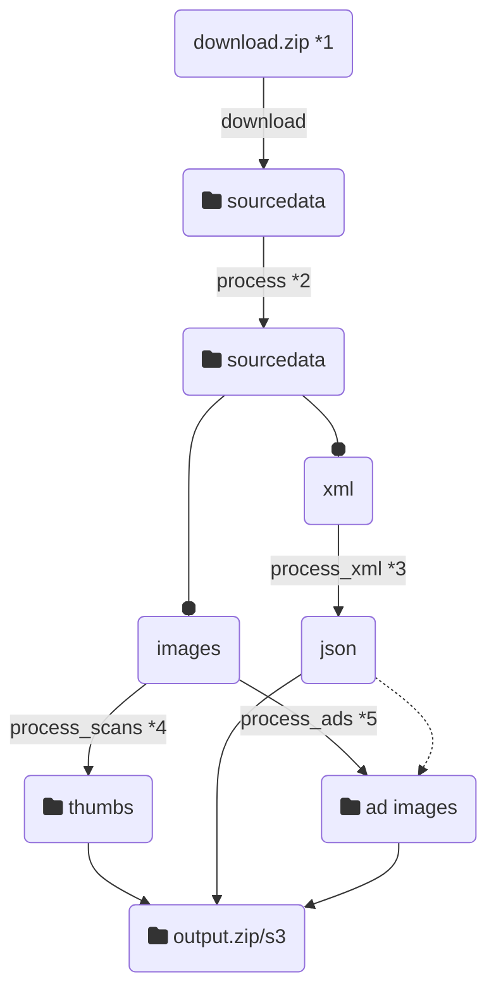

# Vorwärts data pipeline

This repo contains a data pipeline controlled with `make` that downloads and transforms `image` and `xml` data which is used by a [web application](https://vorwaerts-demo.fly.dev/) to display the images organized and enriched with textual data.
The idea of the project has been developed during the [{COD1NG DA V1NC1} NIEDER.RHEIN.LAND 2021](https://codingdavinci.de/index.php/de/events/niederrheinland-2021) - Hackathon. The data pipeline has been implemented as a capstone project participating in [Pipeline Data Engineering Academy](https://www.dataengineering.academy/) beginning 2022.

## Usage

*The original data is 964 MB! Downloading and processing will take some time. If you want to just test the pipeline, load a smaller data set with this command:*

```sh
$ mkdir -p sourcedata
$ curl https://220402irzzlazozxplo.nextcloud.hosting.zone/s/qYb7LRyrXGWMDkp/download/anzeigen-demo.zip -o sourcedata/anzeigen.zip
```

*The pipeline can upload the result of the process to AWS S3. This requires that an aws account is [set up](https://boto3.amazonaws.com/v1/documentation/api/latest/guide/quickstart.html#configuration) to work with `boto3`. Additionally configure the bucket names in an `.env`. See `example.env` for information.*

Than you are ready to run:

```
$ make full-pipeline
```

This sets up the Python dependencies, downloads the data and processes it. The pipeline creates a file `output.zip`, that can be extracted to local installation of the [web app](https://github.com/staeff/vorwaerts-gallery) for development. If configured, the data is also uploaded to AWS S3. The web app can be configured to read the data from S3.

Use `make help` to see which single command have been implemented and run then as necessary.

## Flow



1) The 964 MB original data file is downloaded the first time this command is run, but stored and re-used for consecutive runs
2) The original data structure needs to be cleaned up for further processing, e.g. renaming `xml` file to match with their corresponding image files.
3) This produces a `json` file, that can be directly read into to database of the web app (written in Django)
4) Simple resizing of the high resolution images for web purposes, save them locally and optionally upload to s3
5) Extracting of subimages using coordinate data from the `json`, save save them locally and optionally upload to s3
