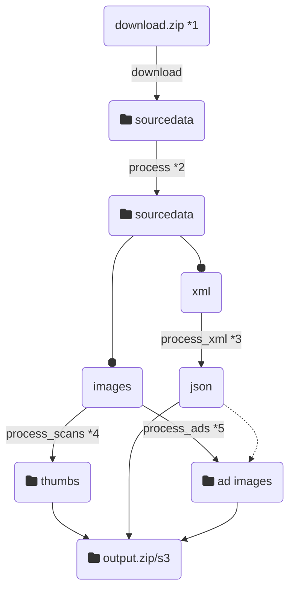

# Vorwärts data pipeline

This repo contains a data pipeline controlled with `make` that downloads and transforms `image` and `xml` data which is used by a [web application](https://vorwaerts-demo.fly.dev/) to display the images organized and enriched with textual data.
The idea of the project has been developed during the [{COD1NG DA V1NC1} NIEDER.RHEIN.LAND 2021](https://codingdavinci.de/index.php/de/events/niederrheinland-2021) - Hackathon. The data pipeline has been implemented as a capstone project participating in [Pipeline Data Engineering Academy](https://www.dataengineering.academy/) beginning 2022.

## Usage

Run `make full-pipeline` to setup the Python dependencies for the project, download the data and process it.

*The original data is 964 MB! Downloading and processing will take some time. For just trying out the workflow replace `https://download.codingdavinci.de/s/7rTJnf5dP3nKJYp/download` with `https://220402irzzlazozxplo.nextcloud.hosting.zone/s/qYb7LRyrXGWMDkp/download/anzeigen-demo.zip` in line 24 of the `Makefile`.*

The result is uploaded to Amazon s3 for the web app to read it from there.

*For this requires a working aws configuration in the environment it is executed and the bucket-names set up in `.env`.*

Additionally the pipeline creates a `output.zip` file, that can be extracted to local installation of the web app for developement.

Use `make help` to see which single command have been implemented and run then as necessary.

## Flow

1) The 964 MB original data file is downloaded the first time this command is run, but stored and re-used for consecutive runs
2) The original data structure needs to be cleaned up for further processing, e.g. renaming `xml` file to match with their corresponding image files.
3) This produces a `json` file, that can be directly read into to database of the web app (written in Django)
4) Simple resizing of the high resolution images for web purposes and uploading to s3
5) Extracting of subimages using coordinate data from the `json` and uploading to s3
